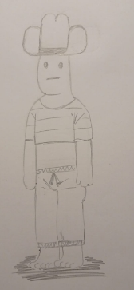
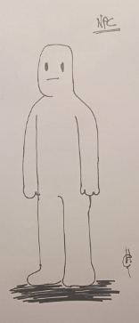
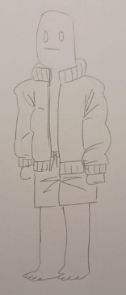
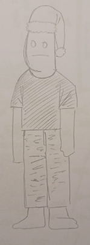
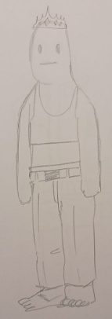
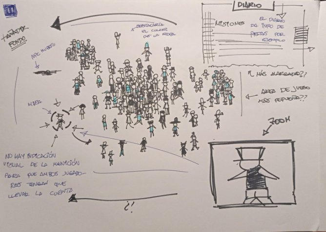
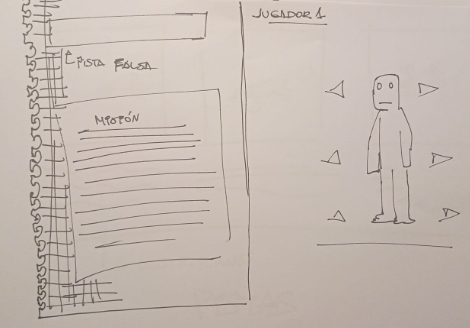
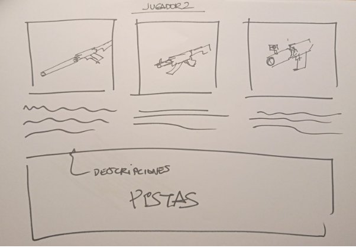

# JER
**TÍTULO DEL JUEGO: TROUBLE IN NPC TOWN**

**DESCRIPCIÓN GENERAL DEL JUEGO:**
- Género: Party; Point and Click
- Perspectiva: 2D Cenital, cámara fija (única escena)
- Estilo: minimalista 
- Audiencia: jugadores casuales.
- Regional: PEGI 3
- Propósito: entretenimiento
- Interacción: teclado y ratón
- Plataforma: ordenador
- Número de jugadores: 2 jugadores
Trouble in NPC Town es un juego en red para dos jugadores. El entorno del juego se basa en una escena fija, sin movimiento de cámara, en la cual se situará el jugador 1, quien debe camuflarse entre los numerosos NPCs de la escena, haciéndose pasar por uno de ellos. El jugador 2, por su parte, debe identificar cuál de todos los personajes de la escena es el jugador 1, acabando con él clicando sobre su personaje. 

**INTEGRANTES DEL EQUIPO DE DESARROLLO:**
Carlos Escribano González, , CarlosEscribano113 (https://github.com/CarlosEscribano113) ||
Sandra Martín-Consuegra Molina-Prados, s.martinm.2021@alumnos.urjc.es, SandraMartin1506 (https://github.com/SandraMartin1506) || 
Hugo Camacho Rodríguez, h.camacho.2021@alumnos.urjc.es, Elaguilaalbina (https://github.com/Elaguilaalbina)  ||
Pablo Melgar Álvarez, , PabloMelgar (https://github.com/PabloMelgar) ||

# **MECÁNICAS:**

**Pantalla de inicio:**

El juego cuenta con una pantalla de inicio en la cual sólo hay tres opciones: “Número de NPCs”, que despliega la personalización de NPCs del juego (explicado más adelante), “Jugar en línea” y “Jugar local”. No existen ajustes para el control de brillo, volumen de la música ni asignación de teclas, pues se trata de un minijuego muy simple y rápido de jugar. 

**Fase de personalización:**

Al comenzar la partida se dará paso a una fase de personalización, en la cual el jugador 1, que debe esconderse entre los NPCs de la escena, personaliza su personaje, eligiendo su camiseta, pantalones y gorro. También debe escribir una pista falsa para confundir a su rival (visto en “Fase de juego”) Mientras tanto, el jugador 2, que ha de asesinar al jugador 1, elige qué arma quiere usar para acabar con él (accesorios y armas vistas más adelante en “Ítems”). Una vez hecha la elección comienza la fase de juego.

**Fase de juego:**

El mundo se genera con un número de NPCs determinados por la dificultad elegida. La vestimenta de estos personajes es elegida por el juego, el cual proporciona a cada uno una camiseta, unos pantalones y un gorro aleatorios. Tanto la posición inicial de los NPCs como la del jugador 1 son también aleatorias.

Al jugador 1 se le presenta una misión de un banco de misiones, la cual debe completar para ganar la partida (siendo el jugador 2 desconocedor de esta). Por su parte, el jugador 2 recibe tres pistas sobre la apariencia de su oponente, dos de ellas generadas por el juego y la tercera escrita por el jugador 1 en la fase de personalización. La partida termina en victoria para el jugador 1 si consigue terminar su misión o si al jugador 2 se le acaba la munición (la cual depende del tipo de arma que haya escogido), mientras que termina en victoria para el jugador 2 si éste consigue eliminar al jugador 1.

Una vez terminada la partida se mostrará quién ha ganado, el motivo de la victoria y un botón para volver a la pantalla de inicio.

**Personalización del número de NPCs:**

Los jugadores podrán modificar el número de personajes de su partida, escogiendo entre tres opciones: pocos, normales y muchos NPCs. Por tanto, cuanto mayor sea este valor más fácil será la partida para el jugador 1 (mayor probabilidad de camuflarse) y más difícil para el jugador 2.

**Pistas:**

Dos de las tres pistas proporcionadas al jugador 2 son verdaderas. Estas pistas simplemente describen la vestimenta de dos de las tres piezas de ropa. Por ejemplo, una pista podría ser: “Tu objetivo lleva pantalones marrones”. Las pistas son generadas una vez el jugador 1 ha escrito su pista falsa en la fase de personalización, por lo que se pueden dar dos casos:

- Una de las pistas verdaderas describe el mismo elemento de ropa que la pista falsa, por lo que el jugador 2 sabrá que la pista restante es verdadera. Ejemplo:
  - “Tu objetivo tiene una camiseta verde.” (verdadera)
  - “Tu objetivo tiene una camiseta a cuadros.” (falsa)
  - “Tu objetivo tiene un gorro azul.” (verdadera)

En este caso, el jugador 2 no sabe cuál es la camiseta del jugador 1, pero está seguro de que su gorro es azul

- Cada una de las tres pistas describe un elemento del vestuario diferente, por lo que el jugador 2 debería ser más cuidadoso a la hora de guiarse por ellas, intentando adivinar cuál es la escrita por su rival.

**Misiones:**

Las misiones que el jugador 1 recibe son simples, pero pueden hacer que delate su posición. Algunas de las posibles misiones son:

- Visita las cuatro esquinas del mapa
- Desplázate durante un tiempo superior a un minuto (en total)
- Mantente quieto durante un minuto (en total)
- Mantente en zonas despejadas de NPCs durante 30 segundos (en total)
- Mantente en aglomeraciones de NPCs durante 30 segundos (en total)

Estas misiones son sólo ejemplos, estando sujetas a cambios. Conforme se vaya desarrollando el juego se irán agregando nuevas misiones.

**Diferencias Online vs. Local:**

La fase de juego es igual en la versión online y local, puesto que un jugador sólo controla al personaje con el input del teclado mientras que el otro sólo controla una mira mediante el input del ratón (visto en “Controles”). Sin embargo, la fase de personalización debe ser distinta, pues los jugadores no deberían saber las elecciones de su rival. Por tanto, la única diferencia entre el juego en red y el local es que en este último las pantallas de personalización se realizan por turnos. Primero, el jugador 1 escoge su vestimenta y escribe la pista falsa para el jugador 2. Además, es en esta pantalla en la que recibe su misión, pues esta no debería ser conocida por el rival, siendo imposible que la misión aparezca escrita en la fase de juego. Posteriormente, el jugador 2 elige el arma que quiere usar. En todo momento aparecerá un mensaje en la pantalla que recuerda que no se puede observar la personalización del rival. Cada arma tiene una mira personalizada para el jugador 2, por lo que en el juego local esta será sustituida por una mira genérica para no desvelar a su rival el arma que ha escogido. Además, si el arma tiene zoom este se realizará en una esquina de la pantalla, sobrepuesto a la escena, en lugar de en la pantalla completa.

# **BACKSTORY:**

En su investigación para encontrar la mejor forma de remodelar los NPCs de su videojuego en línea más famoso, la empresa DCAPDCAM (*Don’t Care About Players; Do Care About Money*) ha creado una inteligencia artificial tan potente que es capaz de dotar a ciertos personajes de sentimientos y autoconsciencia bajo ciertas condiciones específicas. Fruto de esto, *Town3NPC(54)* (o como prefiere llamarse él, Pedrete), harto de tener que lidiar con molestos jugadores, intenta iniciar una rebelión de NPCs, causando un desajuste en el comportamiento de todos ellos. Ante la imposibilidad de reiniciar el servidor para arreglar el problema debido a las posibles quejas de los jugadores, su administrador, Raúl, debe encontrar desde dentro del propio juego al NPC descarriado que está causando el problema y acabar con él antes de que sea demasiado tarde.*  
# **CONTROLES**

Para interactuar con el videojuego es necesario el uso de teclado y ratón. El Jugador 1, que controla al personaje, debe utilizar únicamente el teclado excepto en la fase de personalización del personaje, donde puede elegir las opciones de vestimenta con el click izquierdo del ratón y, además, como anteriormente se ha mencionado en el apartado “pistas”, utiliza el teclado para escribir la pista falsa. Una vez comience el juego, el personaje debe moverse por el escenario hacia arriba, abajo, izquierda y derecha utilizando las teclas WASD.

Por otro lado, el Jugador 2, que controla el arma, debe utilizar el ratón para controlar la mira del arma que previamente ha escogido. Esta se puede mover por todo el mapa siguiendo el movimiento del ratón. Para disparar se utiliza el click izquierdo, mientras que para usar el zoom en las armas que lo tengan se utiliza el click derecho.
# **ITEMS**

Los objetos del videojuego son las diferentes prendas de ropa que tienen tanto los NPCs como el personaje del Jugador 1 y las 3 diferentes armas que el Jugador 2 tiene que elegir.
## **Ropa**
Las prendas de ropa que se utilizan son tan solo 3: pantalones, camiseta y gorro, y tan solo cambiarán los colores, los tipos (un gorro puede ser de lana o de copa, por ejemplo) y los patrones de estos.
## **Armas**
Hay tres armas seleccionables en el juego y cada una tiene sus propias características:
### **Subfusil**
Es el arma con la mira más pequeña. Tiene la posibilidad de disparar 8 balas y no permite el zoom. Quita la mitad de la vida del personaje al que haya atacado. Recomendada para tener más margen de error, pero no tiene mucha precisión. 

### **Francotirador**
El arma tiene una mira mediana. Tiene la posibilidad de disparar 3 balas y es la que más zoom tiene. Mata personajes de una sola bala.

### **Lanzagranadas**
Es el arma con la mira más grande. Tiene la posibilidad de disparar tan solo una bala y podrá hacer zoom, pero no tendrá tanta profundidad como el francotirador. Sin embargo, es un arma cuyo impacto afecta en áreas y no individualmente como en el caso de las otras dos. Quita la vida entera de los personajes que se encuentren en el área de impacto.

# **ESTÉTICA** 

### **Gráficos**
Los gráficos del juego están dibujados a mano y en 2D, son muy minimalistas y orientados a representar puramente lo estricto y necesario. Todo el fondo es en blanco y negro, tiene algún detalle dibujado pero bastante poco, está mayormente vacío, el único color del juego son las prendas de los personajes. Los personajes tienen todos el mismo cuerpo simple, de color blanco y con un trazo negro, la única diferencia son sus prendas, que además son ligeramente más grandes que sus torsos y de colores vivos. El trazo de las mismas es ligeramente más grueso para que destaquen y se vean bien.

Todo el juego se ve en cenital, imitando la perspectiva que tendría un tirador ubicado en un edificio alto de una plaza o calle muy transitada, quizá recordando ligeramente a las ilustraciones de un libro de encontrar a Wally. Ambos jugadores comparten punto de vista y tienen la misma información básica por pantalla. Sin embargo, el escenario no ocupa toda la pantalla para que la interfaz no se interponga en la visión del mapa.

**Menús**

La estética de los menús también es minimalista. Los menús durante la partida imitan las hojas arrancadas de un típico cuaderno de cuadrícula con los textos imitando estar escritos  a boli en una caligrafía simple, mientras que los menús de fuera de partida imitan el estilo típico de código de las películas de hackers. Las pantallas de selección de antes de las partidas comparten esa estética minimalista blanco y negro aunque tienen imágenes a color.
# **APARTADO SONORO**

El apartado sonoro del videojuego también es bastante minimalista, ya que consiste en pocos efectos de sonido distintos. Los sonidos sirven para representar algunas de las acciones de los jugadores y para dar ambientación al juego.
### **Sonido ambiente**
Como sonido ambiente para el juego se utiliza un sonido de murmullo que se reproducirá en bucle a lo largo de toda la partida. Este sonido se pausará únicamente cuando el jugador 2 dispare, causando un silencio de varios segundos tras el disparo para enfatizar la acción del jugador. 
### **Sonidos de armas**
Cada arma tiene un sonido propio correspondiente al disparo de cada una de las armas. El subfusil y el francotirador tiene un sonido del disparo del arma, y el lanzagranadas un sonido del disparo y de la explosión de la granada. Estos sonidos se reproducen cuando el jugador 2 hace click para disparar con el arma que haya elegido.
### **Sonidos de interfaces**
Fuera de la partida, hay también varios efectos de sonido para las interacciones que haya con elementos de la interfaz y de los menús. Cuando se abre un menú se reproduce un sonido de papel arrugandose, para seguir la estética de hojas de cuaderno de las interfaces. También se reproduce otro sonido cuando se selecciona cualquier opción de los menús.

# **INTERFACES**

El juego cuenta con ocho interfaces:
### **Pantalla de inicio** 
un fondo blanco con sprites de algunos NPCs repartidos por la pantalla, el título del juego y dos botones con la estética de hacker de configuración y empezar partida. Al darle a comenzar los botones cambian a ser uno de modo de juego en red y otro en modo de juego local.
### **Pantalla de configuración** 
La pantalla de configuración tiene la misma estética de películas de hackers. Esta pantalla cuenta únicamente con la configuración del número de NPCs, contando con tres botones con la estética ya mencionada: “Pocos”, “Normales” y “Muchos”.
### **Pantalla de selección jugador 1**
Esta se muestra al iniciar partida, está dividida en dos zonas, a la izquierda se muestra, en la estética de hacker la misión a realizar y hay un espacio donde escribir una pista falsa y a la derecha un maniquí con el que seleccionar el atuendo, esto se muestra con un maniquí que tiene flechas a cada lado de la cabeza, torso y piernas, al hacer click izquierdo en esas flechas se le irán cambiando las distintas prendas.

### **Pantalla de selección jugador 2**
Va después de la del jugador 1 (simultáneamente si se está jugando en línea). Esta muestra ilustraciones de las tres armas en fila con su nombre y descripción en la estética de hackers para que el jugador 2 escoja y debajo las tres pistas que le han tocado.

**Interfaces de partida**

Durante la partida hay tres interfaces visibles en todo momento. En la esquina superior izquierda de la pantalla aparece un botón en forma de post it en el que pone diario. Al hacerle click izquierdo el jugador 2 se despliega una hoja de cuaderno con las pistas escritas, esta hoja tiene el mismo post it de diario debajo, al darle click izquierdo se cierra. En el lado derecho tiene otro post it: al darle click izquierdo pasa a otra página con todas las posibles misiones del jugador 1 descritas para consultarlas en todo momento. Finalmente, si el jugador hace click derecho en cualquier parte del escenario con una de las armas con zoom una ventana se abrirá en la esquina superior derecha que hace un zoom permanente a la zona clickeada hasta que se hace click derecho en otra zona, lo que hace un zoom nuevo, o en la propia ventana, lo que la cierra.
### **Pantalla de pausa**
Esta pantalla se puede acceder durante la partida del juego. Sirve para pausar la partida y se puede entrar a ella presionando la tecla esc. En ella se pueden elegir dos opciones, una para continuar la partida que se ha pausado y otra para volver a la pantalla de inicio de manera que se pueda iniciar una nueva partida.
